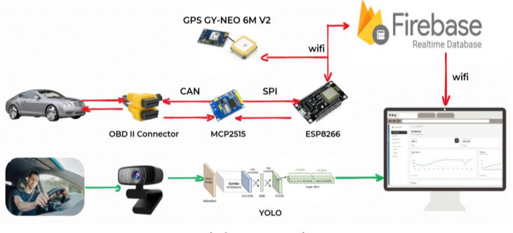
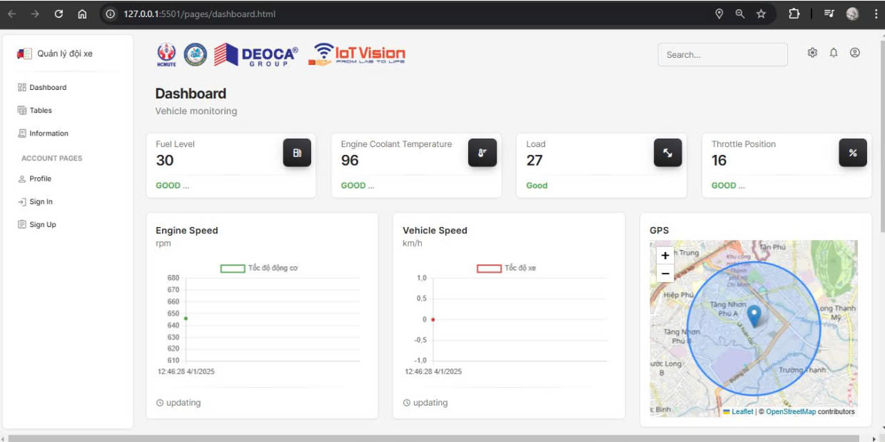
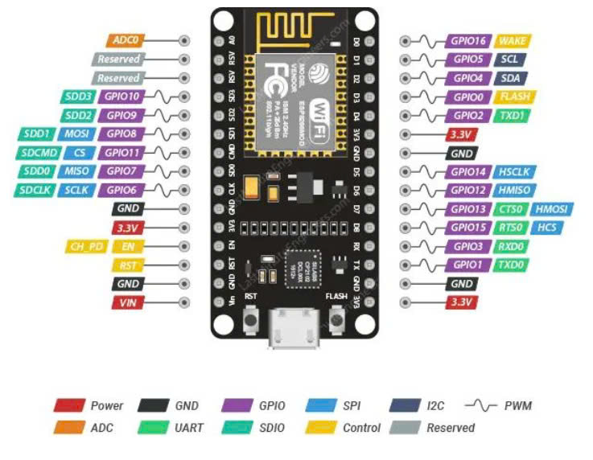

# CAR_SUPERVISING BASE ON OBD2 & GPS

## 1. Overview

<p align = "center">
  

With this system, we are able to communicate with vehicles through the OBDII port and upload data to Firebase. Finally, the results are visualized through a website interface.

<p align = "center">
  
   
## 2. Hardware

<p align = "center">
 
   
### How to install ESP8266_hardware
B1: Open ArduinoIDE  
B2: File --> Preferences  
B3: Board Manager URL:
```bash 
http://arduino.esp8266.com/stable/package_esp8266com_index.json
```  
B4: manage Board --> search "esp8266" --> install

### How to install Arduino.json7
B1: Click on the library tab in the Arduino IDE  
B2: Search for “ArduinoJson”  
B3: Select the version: 7.2.1  
B4: Click install

## 3. Library

### For GPS module Neo-6M:

```bash
https://github.com/mikalhart/TinyGPSPlus
```

```bash
https://github.com/plerup/espsoftwareserial/
```

### For WiFi & FireBase

```bash
https://github.com/mobizt/Firebase-ESP8266
```

### For OBD-II
```bash
https://github.com/ttlappalainen/CAN_BUS_Shield
```
